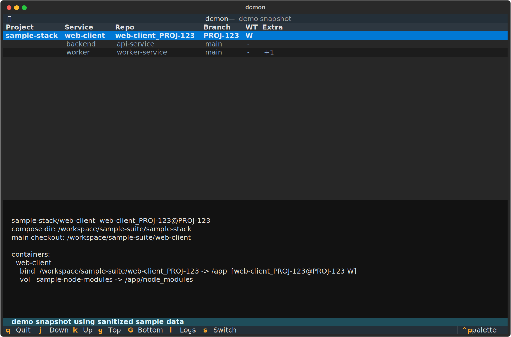

# dcmon

`dcmon` is a Textual terminal UI for inspecting running Docker Compose services and switching git-backed mounts across matching worktrees.

It is built for local development environments where Compose services bind-mount Git checkouts and you regularly move between a base checkout and ticket-specific worktrees.

_Disclaimer: this repo is maintained mostly by AI, with humans doing the important job of testing whether the robots are being helpful or just confidently weird._



_Screenshot uses sanitized demo data._

## What It Does

- lists running Docker Compose services grouped by project
- detects the repo, branch, and worktree behind bind-mounted source trees
- shows detailed mount information for the selected service
- opens a live log viewer for the selected service
- plans and applies worktree-aware mount switches using a temporary Compose override file

## Requirements

- Docker
- Docker Compose v2
- Python 3.9+ to run from source

## Run From Source

```bash
make run
```

That launches `dcmon.py` directly through `uv`.

## Controls

Main screen:

- `j` / `k`: move selection
- `g` / `G`: jump to top / bottom
- `l`: open logs for the selected service
- `s`: open the worktree switch flow
- `q`: quit

Picker and preview dialogs:

- `/`: focus the filter input
- `Enter`: confirm
- `Esc` / `q`: cancel

## Development

- `make lint`
- `make test`
- `make run`

## Releases

`dcmon` publishes standalone archives for:

- `macOS arm64`
- `Linux x86_64`

Release channels:

- `edge`: rolling prerelease built from the latest push to `main`
- `dcmon-v*`: stable tagged releases
- pull requests: workflow artifacts only

## Running A Downloaded Build

1. Download and unpack the archive for your platform.
2. Run `./dcmon --version` to verify the binary starts.
3. Run `./dcmon` from a terminal on a host with Docker and Docker Compose available.

`dcmon` expects to inspect local Docker containers. It does not bundle Docker itself.

## macOS Quarantine

GitHub-downloaded binaries may be blocked by Gatekeeper. If macOS refuses to open `dcmon`, remove the quarantine attribute:

```bash
xattr -d com.apple.quarantine ./dcmon
```

Then run the binary again from the terminal.
